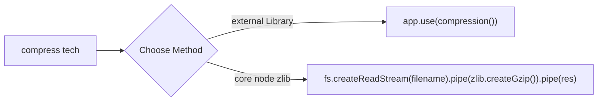

1. [ ] **Next.js Internal Router** → Next.js uses its own internal router (`next/router`) built on top of the file system, not React Router, and leverages the History API for client-side navigation. ✅ 2025-09-12

2. [ ] **Package Managers** → Comparison of npm (default), Yarn (Facebook's alternative with yarn.lock), pnpm (disk space-efficient), and Bun (all-in-one JavaScript runtime with built-in package manager). ✅ 2025-09-12

3. [ ] **Rate Limiting** → Express middleware to limit requests per IP address to prevent abuse. ✅ 2025-09-12

```js
import rateLimit from "express-rate-limit"
const limiter = rateLimit({
  windowMs: 15 * 60 * 1000,  // 15 minutes
  max: 100, // limit each IP to 100 requests per windowMs
  message: {
    status: 429,
    error: "Too many requests, please try again later."
  }
});
app.use(limiter)
```

4. [ ] **Morgan Logging** → Express middleware that logs every incoming HTTP request (method, URL, status, response time) for debugging and monitoring. ✅ 2025-09-12

```js
app.use(morgan('dev'));
// Output: GET / 200 8.123 ms - 18
```

5. [ ] **Airbyte Data Pipeline** → Open-source data pipeline tool for moving data between systems, like a background job manager specialized for data transfer between databases/APIs. ✅ 2025-09-12

6. [ ] **Fivetran Data Pipeline** → Paid SaaS version of Airbyte, providing plug-and-play background jobs for data synchronization without managing Redis or queues. ✅ 2025-09-12

7. [ ] **RabbitMQ + AMQP** → Message broker that acts like a post office for your app, safely storing messages in queues until workers are ready to process them. ✅ 2025-09-12

8. [ ] **Bull Queue** → Node.js library for creating and managing job queues using Redis as backend, keeping the main thread free by processing jobs in background workers. ✅ 2025-09-12

```js
const Queue = require('bull')
const emailQueue = new Queue('emailQueue', 'redis://127.0.0.1:6379');
emailQueue.add({
  to: 'user@example.com',
  subject: 'Welcome Email',
  body: 'Hello! Thanks for joining us.'
});

emailQueue.process(async (job) => {
  console.log(`Sending email to ${job.data.to}`);
  return Promise.resolve();
});

emailQueue.on('completed', (job) => {
  console.log(`Job ${job.id} completed!`);
});
```

9. [ ] **Debezium CDC** → Open-source distributed service for Change Data Capture (CDC), capturing database changes and streaming them to Apache Kafka for real-time data pipelines. ✅ 2025-09-12

10. [ ] **MongoDB Change Streams** → MongoDB's built-in CDC mechanism for real-time events from MongoDB, simpler than Debezium for single-database scenarios. ✅ 2025-09-12

```js
const changeStream = db.collection("users").watch();
changeStream.on("change", (next) => {
  console.log("Change detected:", next);
});
```

11. [ ] **New Relic APM** → Observability platform for monitoring runtime data including errors, logs, CPU, memory, DB queries, and slow endpoints, visualized in New Relic dashboard. ✅ 2025-09-12

12. [ ] **Express Async Handler** → Middleware to catch async errors in Express applications. ✅ 2025-09-12

13. [ ] **Node.js Streams** → Handling large data efficiently with streams, including backpressure management for optimal performance. ✅ 2025-09-12

```js
// Handle backpressure
const readable = fs.createReadStream('largeInput.txt');
const writable = fs.createWriteStream('output.txt');
// Pipe handles backpressure automatically
readable.pipe(writable);
writable.on('finish', () => {
  console.log('File copied successfully using pipe!');
});

// Manual backpressure handling
readable.on('data', (chunk) => {
  if (!writable.write(chunk)) {
    readable.pause();
  }
});
writable.on('drain', () => {
  readable.resume();
});
```

14. [ ] **Clinic.js Performance Profiling** → Node.js performance profiling tool for diagnosing event loop, GC, I/O, CPU, and async issues. ✅ 2025-09-12

```bash
npm install -g clinic
clinic doctor -- node server.js  # Diagnose performance issues
clinic flame -- node server.js   # CPU profiling
clinic bubbleprof -- node server.js  # Async profiling
clinic open <generated-file.clinic>  # Open report
```

15. [ ] **Datadog Observability** → Full-stack monitoring platform collecting logs, metrics, traces, network flows, and security events across infrastructure and applications. ✅ 2025-09-12

16. [ ] **Response Compression** → Techniques for compressing HTTP responses using external libraries or core Node.js zlib module. ✅ 2025-09-12



17. [ ] **HTTP Proxy Middleware** → Creating reusable proxy middleware for microservices architecture with error handling. ✅ 2025-09-12

```js
const { createProxyMiddleware } = require("http-proxy-middleware");

const servicesData = {
  product: "http://localhost:3000",
  order: "http://localhost:3001",
};

const getProxy = (service) => {
  return createProxyMiddleware({
    target: servicesData[service],
    changeOrigin: true,
    onError: (err, req, res) => {
      res.status(502).json({
        error: `${service} service is currently unavailable`,
        details: err.message,
      });
    },
  });
};

app.use("/order", getProxy("order"));
app.use("/product", getProxy("product"));
```

18. [ ] **React Hydration** → Process where React takes server-rendered HTML and attaches event listeners to make it fully interactive on the client. ✅ 2025-09-12

19. [ ] **Logging Libraries** → Winston, Bunyan, and Pino provide methods for log, warn, and error storage in respective files. ✅ 2025-09-12

20. [ ] **Zustand State Management** → Lightweight React state management library with minimal boilerplate and no provider needed. ✅ 2025-09-12

21. [ ] **SOLID Principles** → Five object-oriented design principles for writing maintainable and scalable code. ✅ 2025-09-12

22. [ ] **Prometheus Metrics** → Metrics collector and time-series database that scrapes application metrics and stores them over time, visualized by Grafana. ✅ 2025-09-12

23. [ ] **Error Handling** → `uncaughtException` handles unhandled synchronous errors, while `unhandledRejection` handles unhandled Promise rejections. ✅ 2025-09-12

24. [ ] **CPU Architectures** → Understanding x86, ARM, x64, and IA-32 instruction sets and their differences in processing capabilities. ✅ 2025-09-12